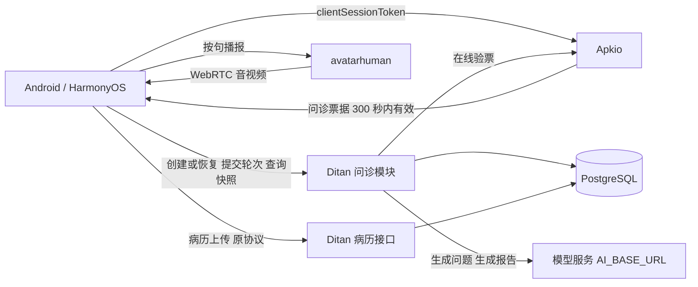
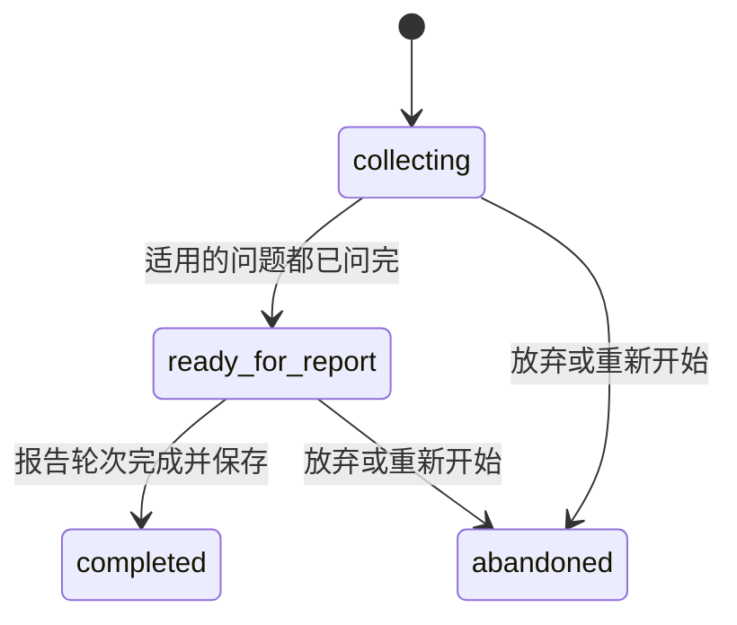
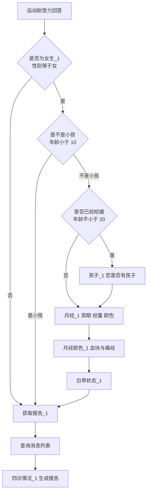

# 四诊问诊后端迁移设计

本文面向 avatarhuman、MCT_Android、MCT_Harmonyos、Apkio 和 DitanBackend 的维护者，说明如何把 Coze 上的四诊"问诊"工作流迁入自有后端，重点解决问诊会话的持久化和故障恢复。本文合并了此前的两版方案（初版迁移设计和精简方案），并依据 [Coze 工作流详细信息](coze工作流详细信息.md)（含全部节点提示词）和业务方的确认修订了流程部分。其他依据是 2026-10-03 五个仓库的本地代码和[原工作流设计文档](../../四诊“问诊”工作流后端设计.md)。目前尚未修改业务代码；文中对现有代码问题的描述来自代码阅读，没有在线上复现。

## 结论

在 DitanBackend 中新增问诊模块（consultation），问诊状态存入 PostgreSQL。第一版按 Coze 现有流程原样迁移：问题顺序、女性分支、报告提示和报告生成都与 Coze 一致，并直接复用 Coze 的节点提示词。每轮回答只调用一次模型，用来生成下一个问题；模型不可用时，直接使用节点里写好的固定问题。

会话方面：客户端为每一轮生成 `turn_id` 作为幂等键，服务端用 `version` 做并发控制，用 `attempt` 保证每轮结果只提交一次。avatarhuman 只负责数字人音视频；Apkio 签发问诊专用票据；病历上传沿用现有协议。第一版不引入独立 worker、任务队列、Redis 或通用工作流引擎，取舍见第 13 节。

原工作流设计文档提出的"状态机 + 填槽"（信息抽取、模糊追问、冲突澄清）和女性生理阶段重构，在 Coze 现有流程中都还没有实现。它们会改变问诊行为，还需要业务方补充定义，因此放在第 12 节，作为第二版的可选增强。顺序是先换平台、保持行为不变，再改进行为。

第一版的验收目标：

- 答到一半关闭 App，重新进入后回到原来的问题，已答内容都在；
- 数字人断线重连、Ditan 重启或网络中断后，问诊不丢失，也不从头开始；
- 重复发送同一条回答，流程不会重复推进；
- 模型偶发失败不会卡住问诊；
- 问题顺序、分支和报告格式与 Coze 一致，可以用同一批脱敏对话对照。

已确定的事项：

- 模型沿用 Ditan 当前配置：`AI_API_KEY`、`AI_BASE_URL`、`AI_MODEL_NAME`（默认 `deepseek-chat`）。Coze 节点显示的模型是"扣子-deepseek"，同属 DeepSeek；各节点的模型参数都是默认值，没有调整过。
- 节点提示词已经收齐，见 [Coze 工作流详细信息](coze工作流详细信息.md) 第 13、15 节。
- 流程已与业务方确认：女性分支按 4.3 的流程；"精力与情绪"和"夜间起夜"两题的先后可以灵活处理。
- 问诊何时结束沿用 Coze 的做法：每个适用的问题问一次，不追问，问完即提示获取报告。
- avatarhuman 的 `cozechat-s` 网页不在本次范围内。

## 1. 现状

### 1.1 Coze 工作流的实际结构

工作流 `talkingwithMrWang` 共有 41 个节点，详见[详细信息文档](coze工作流详细信息.md)。根据节点的输入输出和提示词，可以还原出它的结构：

1. **开始**：入参 `USER_INPUT` 是客户端发来的第一条消息，也就是客户端拼好的患者信息和面舌脉分析文本。之后的每个节点都把它当作"患者信息"使用。
2. **性别和年龄**："性别判断"节点从患者信息中提取性别；"获取年龄"节点提取出生日期，再由 `calculate_age` 算出年龄。
3. **11 个固定问题**：每个问题由一个大模型节点和一个同名的问答节点组成。大模型节点的提示词末尾写着本轮要问的固定问题，模型结合患者信息、上一轮的问题和回答，把它改写成不超过 50 字的自然问法；问答节点把问题发给患者并等待回答。无论患者怎么回答，流程都直接进入下一题，没有追问。
4. **女性分支**：三个条件节点决定是否追加孩子、月经、月经血块与痛经、白带这 4 个问题。它们分别是"是否为女生_1"（性别等于"女"）、"是不是小孩"（年龄与 10 比较）和"是否已经结婚"（年龄与 20 比较；名称叫"结婚"，比较的却是年龄）。
5. **获取报告**：问答节点发出固定文案"感谢您的回答，正在为您分析身体情况，请点击下方按钮，获取报告"，然后等待。客户端把"获取报告"作为回答发出后，流程继续。
6. **报告**：先查询消息列表取得整段对话，再由"四诊情况_1"节点结合对话和患者信息做八纲辨证，输出纯文本报告：给出主证、兼证和依据，不给治疗或温养建议。

也就是说，Coze 实际运行的是一份**固定顺序的问卷**：模型只负责把每个固定问题说得自然，以及最后生成报告，并不做信息抽取、追问或冲突澄清。原工作流设计文档流程图中的五种女性生理阶段属于计划中的修改，Coze 尚未实现；Coze 现在问的是孩子、月经、血块与痛经、白带这四项。

详细信息文档中没能从页面读出的连线和分支去向，已与业务方确认（见 4.3）；各大模型节点都使用默认参数。仍未读到的是条件节点的边界写法、`calculate_age` 的实现、消息查询的条数上限和会话历史开关，处理方式见 4.3 和第 16 节，均不阻塞开发。

### 1.2 现有实现

| 位置 | 实际行为 | 对迁移的影响 |
| --- | --- | --- |
| avatarhuman [SessionManager](../backend/application/session_manager.py) | 在内存中保存 WebRTC 连接和数字人 runtime，断开即释放 | 这是媒体会话，不能承载问诊状态 |
| avatarhuman [Coze 代理](../backend/infrastructure/coze_proxy.py) | 转发 Coze `/v3/chat`，只有 `cozechat-s` 网页在用 | 两个移动端不经过它，只改这里无法完成切换 |
| Android [CozeGateway](../../MCT_Android/app/src/main/java/com/example/mct/platform/network/CozeGateway.kt) | 从 BuildConfig 读取 Coze 地址、令牌和 bot，直连 Coze | 需要整体替换 |
| Android [ConversationSession](../../MCT_Android/app/src/main/java/com/example/mct/feature/digitalhuman/domain/DigitalHumanConversationSession.kt) | conversationId 只在内存；重新开始数字人会话时清空，并重新发送患者信息 | 杀 App 或重连后问诊从头开始 |
| Android [CozeStreamParser](../../MCT_Android/app/src/main/java/com/example/mct/platform/network/CozeStreamParser.kt) | 每个网络块单独做 UTF-8 解码，每次调用都重新初始化事件解析状态 | 事件、JSON 或汉字被网络分块切开时会丢内容 |
| Harmony [HarmonyDigitalHumanService](../../MCT_Harmonyos/entry/src/main/ets/platform/digitalhuman/HarmonyDigitalHumanService.ets) | 直连 Coze，另有 chat retrieve 和 message list 的轮询补偿 | 需要整体替换 |
| Harmony [DigitalHumanPage](../../MCT_Harmonyos/entry/src/main/ets/pages/DigitalHumanPage.ets) | `startRealtimeSession` 清空 conversationId，连上后 `bootstrapConversation` 重新发送患者信息；进入页面时只从 `cozeConversationLog` 恢复文字 | 每次数字人重连或刷新都从头问诊；恢复文字不等于恢复流程 |
| 两个移动端 | 根据回复是否包含"请点击下方按钮，获取报告"判断阶段，再把"获取报告"作为回答发给 Coze | 流程阶段依赖文案匹配 |
| 两个移动端 | 在客户端拼接患者信息文本（即 Coze 的 `USER_INPUT`）。两端已经不一致：Harmony 带了电话和目标体重，Android 两者都没带；两端都带了姓名 | 改为由服务端根据结构化资料统一生成，姓名和电话不再发给模型 |
| Ditan [ChatService](../../DitanBackend/app/services/chat_service.py) 与聊天表 | 医生端聊天，按机构隔离 | 复用模型客户端和机构隔离方式，不复用表 |
| Ditan [病历模型](../../DitanBackend/app/models/medical.py)与上传 | 同机构、同 uuid、同内容的重传返回原记录，内容不同返回 409；`diagnosis_result` 列为 `String(1024)`，DTO 和服务层都没有长度处理 | 超过 1024 字的报告写库会失败；病历要在问诊结束后一次性上传 |
| Apkio [病历上传票据](../../Apkio/docs/MEDICAL_UPLOAD_AUTH_CONTRACT.md) | audience 为 `ditan-medical-upload`，scope 为 `medical-record:write`，最长 300 秒，由 Ditan 在线验票 | 问诊复用同一机制，新增 audience |

### 1.3 需要顺带解决的问题

- **可以立即单独修复**：用 Alembic 把 `sanzhen_analysis_results.diagnosis_result` 改为 `TEXT`。这项修复与本次迁移无关，宜尽早上线。L14 的报告示例已有约 500 字，实际报告超过 1024 字并不意外。
- **在迁移中消除**：媒体会话与问诊会话解耦；问诊引用持久化；流程阶段由服务端给出；报告改为显式命令；患者信息文本改由服务端生成；姓名、电话不再发给模型。
- **迁移完成后处理**：Coze 令牌目前被编译进了安装包。Android 放在 BuildConfig 里；Harmony 的 `LocalConfig.generated.ets` 虽然已被 git 忽略，但仍会编进 HAP，解包即可取得。全面切换后，应在 Coze 后台吊销该令牌，并删除客户端中的 Coze 配置。新方案中模型密钥只存放在 Ditan 服务端。

## 2. 总体架构



| 项目 | 本次职责 |
| --- | --- |
| DitanBackend | 问诊 API、问诊步骤、轮次处理、模型调用和报告；与病历共用数据库和部署 |
| Apkio | 签发和验证问诊票据，复用现有的账号、设备、机构和 License 校验 |
| avatarhuman | 只负责数字人音视频和播报，不保存问诊状态 |
| Android、HarmonyOS | 采集资料、录音与 ASR、提交回答、恢复问诊、按句播报、上传病历 |

问诊模块不放在 avatarhuman，原因是：avatarhuman 是 GPU 媒体服务，会话只保存在内存里，没有数据库、机构身份和病历。问诊与病历同属业务数据，放在 Ditan 可以共用 PostgreSQL、Alembic、Apkio 验票和机构隔离，模型调用也不会占用数字人进程。

Ditan 中的代码组织沿用现有分层：

```text
app/api/consultation.py                      路由，在 app/api/router.py 中挂到 /api/v1/consultations
app/schemas/consultation.py                  请求与响应模型
app/models/consultation.py                   表定义（需加入 app/models 的导出，Alembic 才能发现）
app/repositories/consultation_repository.py
app/services/consultation/
    service.py                               创建、快照、轮次受理与提交
    runner.py                                进程内的轮次执行与流式分发
    llm.py                                   生成问题、生成报告两类模型调用
    workflows/v1.py                          步骤定义：顺序、适用条件、提示词文件、固定问题
    prompts/v1/                              从 Coze 迁来的提示词原文，每个节点一个文件
alembic/versions/                            新增迁移脚本
```

详细信息文档第 9 节建议实现一个可暂停、可恢复的通用节点执行器。但这里的流程只有一条主线和一个女性分支，用代码定义的步骤列表加上"当前步骤"就能表达；暂停和恢复由第 5 节的轮次协议承担，不需要实现通用的节点图和变量绑定。

Ditan 以 `uvicorn --workers 4` 运行（见其 Dockerfile），同一问诊的请求可能落到不同进程上。因此正确性只依赖数据库；进程内状态仅用于把流式输出转交给同一进程里的连接。

## 3. 会话与标识

### 3.1 三类会话互不依赖

| 会话 | 标识 | 保存位置 | 生命周期 |
| --- | --- | --- | --- |
| 媒体会话 | avatarhuman `/offer` 返回的 `sessionid` | avatarhuman 内存 | 随 WebRTC 建立和断开，随时可以重建 |
| 问诊会话 | `consultation_id`，业务键为 `(org_id, encounter_uuid)` | Ditan PostgreSQL | 经历断网、杀 App、重新登录和服务重启后仍然保留 |
| 授权会话 | Apkio 的 clientSession，以及由它换取的问诊票据 | Apkio | 票据过期后重新换取，不影响问诊 |

媒体断开只影响播报，票据过期只需重新取票，两者都不改变问诊状态。

### 3.2 标识

| 标识 | 含义 | 规则 |
| --- | --- | --- |
| `org_id`、`user_id`、`device_id` | 机构、操作员、设备 | 只从 Apkio 验票结果中取得，不接受请求体传入；操作员不是患者 |
| `encounter_uuid` | 本次就诊，即病历的 `uuid` | 开始采集时生成并写入患者草稿；一次就诊对应一个 |
| `pre_diagnosis_uuid` | 预诊记录的 uuid | 与 `encounter_uuid` 同时生成，随问诊保存，归档时使用 |
| `consultation_id` | 一次问诊 | 由服务端生成；同一次就诊同时只能有一个未放弃的问诊 |
| `turn_id` | 一轮输入（开场、回答或报告） | 客户端生成 UUID，发送前先写入本地；重试时必须沿用 |
| `version` | 问诊版本 | 每完成一轮加 1；客户端提交时带上，服务端据此发现过期状态 |
| `attempt` | 某一轮的第几次执行 | 由服务端维护；只有当前 attempt 能提交结果 |
| 媒体 `sessionid` | avatarhuman 的连接标识 | 随时可以变化，不参与问诊身份判断 |

手机号、设备 ID、媒体 sessionid 和 Coze user ID 都不能作为问诊标识。

### 3.3 encounter_uuid 的生成时机

Harmony 的 [PatientSession](../../MCT_Harmonyos/libs/common-domain/src/main/ets/model/PatientSession.ets) 在创建草稿时就已分配 `uuid` 和 `preDiagnosisUuid`，可以直接使用。Android 的 [PatientSessionMapper](../../MCT_Android/app/src/main/java/com/example/mct/feature/patient/session/PatientSessionMapper.kt) 要到映射落库实体时才生成，需要改为在开始采集时生成并持久化，之后的所有转换都复用这两个值。"恢复本次问诊"和"为老患者新建就诊"是两个不同的操作，后者必须生成新的 uuid。

## 4. 问诊流程（v1：按 Coze 原流程迁移）

### 4.1 原则

- 行为与 Coze 一致：问题顺序和分支相同，每题只问一次，报告提示和报告提示词也相同。这样上线前可以用同一批对话对照新旧输出，出现差异时也容易定位。
- 由代码决定问哪一题、何时结束；模型只负责把固定问题改写成自然的问法，以及生成报告。
- 性别和年龄直接取自结构化资料，不再用模型提取，替代"性别判断""获取年龄"和 `calculate_age` 三个节点。

### 4.2 问诊状态



"正在处理"和"报告生成中"不是问诊状态，而是由进行中的轮次表示（见第 5 节）。关闭页面、断网或媒体断开都不会改变问诊状态。第一版在 `completed` 之后不允许修改，需要更正时新建就诊；`abandoned` 只能由"放弃或重新开始"显式产生。

### 4.3 步骤定义

```python
# app/services/consultation/workflows/v1.py（示意）
STEPS = [
    Ask("core_history",        prompt="L03"),  # 核心病史与用药
    Ask("family_health",       prompt="L04"),  # 家族健康
    Ask("work_stress",         prompt="L05"),  # 工作与压力
    Ask("sleep_quality",       prompt="L07"),  # 睡眠质量
    Ask("nocturia",            prompt="L11"),  # 夜间起夜
    Ask("energy_mood",         prompt="L06"),  # 精力与情绪
    Ask("diet_core",           prompt="L08"),  # 核心饮食习惯
    Ask("diet_extra",          prompt="L09"),  # 额外饮食习惯
    Ask("digestion",           prompt="L10"),  # 消化与排便
    Ask("exercise_habit",      prompt="L12"),  # 运动习惯
    Ask("exercise_tolerance",  prompt="L13"),  # 运动耐受力
    Ask("children",            prompt="L15",   # （女）孩子_1
        when=lambda c: c.is_female and not c.is_child and c.over_20),
    Ask("menstruation",        prompt="L16",   # （女）月经_1
        when=lambda c: c.is_female and not c.is_child),
    Ask("menstruation_detail", prompt="L17",   # （女）月经颜色_1，实际问血块与痛经
        when=lambda c: c.is_female and not c.is_child),
    Ask("leukorrhea",          prompt="L18",   # 白带状态_1
        when=lambda c: c.is_female and not c.is_child),
    ReportGate("感谢您的回答，正在为您分析身体情况，请点击下方按钮，获取报告"),
]
REPORT_PROMPT = "L14"  # 四诊情况_1
```

每个 `Ask` 步骤包含四项：步骤 ID、提示词文件、固定问题，以及该提示词是否引用上一轮的问答。固定问题就是提示词末尾"以下为你要提问的问题"之后的那句，用作降级文案。L03、L15、L16 只引用患者信息，其余提问节点还引用上一轮的问题和回答。

主线 11 题按原工作流设计文档中的流程图排列。详细信息文档的节点清单中，"精力与情绪""夜间起夜"两题的位置与流程图不同；业务方确认两者的先后可以灵活处理。

女性分支的流程如下，已与业务方确认：



性别与年龄的处理：

- 年龄按周岁计算，基准日为问诊创建当天（北京时间），并与计算结果一起保存。
- 性别缺失时按"非女性"处理，跳过女性分支。这与 Coze 中"性别判断"取不到"女"时的结果一致。
- 条件边界按"小于 10 岁为小孩""20 岁及以上问是否有孩子"实现。Coze 条件节点用的是"小于"还是"小于等于"没有读到，这只影响恰好 10 岁或 20 岁的患者；如与 Coze 不同，改一处即可。
- 生日缺失或无效时年龄未知，按"不是小孩、未满 20 岁"处理：询问月经、血块与痛经、白带，不问是否有孩子。

### 4.4 每轮处理

```text
开场（start）
  渲染并固定患者信息文本（见 4.6），当前步骤设为第一个适用步骤（core_history）
  用 L03 提示词生成第一个问题（流式）

回答（answer），状态为 collecting 时
  1. 记录回答，归属当前步骤
  2. 找到下一个适用步骤
  3. 如果下一个是提问步骤：用患者信息、上一轮的问题（刚才问的那句）和上一轮的回答（本轮回答）
     渲染该步骤的提示词，流式生成问题，当前步骤前移
  4. 如果下一个是获取报告：回复固定文案，不调用模型，状态改为 ready_for_report

回答（answer），状态为 ready_for_report 时
  记录这段话（它会进入报告的对话记录），再次回复固定文案，不调用模型

报告（report），状态为 ready_for_report 时
  用 L14 提示词，以全部对话和患者信息生成报告（流式）；保存后状态改为 completed
```

降级规则：

- 提问调用失败（超时、报错或空输出）时，直接使用该步骤的固定问题；如果已经输出了一部分，先发送 `reset`，再给出固定问题。
- 模型连续失败时短时熔断，直接使用固定问题，避免每轮都等到超时。
- 因此即使模型服务完全不可用，问诊也能按固定问题问完并保存全部回答，只有报告需要等模型恢复后再生成。

每轮只调用一次模型，从提交回答到听到第一句的延迟约等于模型返回首个 token 的时间。

### 4.5 提示词迁移

- 提示词按节点存为文件（如 `prompts/v1/L03_core_history.txt`），内容取自详细信息文档第 15 节，不做改写。唯一的处理是把复制时产生的 `{{USER\_INPUT}}` 规范化为 `{{USER_INPUT}}`。
- 变量替换只替换已声明的占位符，插入的患者内容不会被再次当作模板解析：

| 占位符 | 含义 | 新后端的取值 |
| --- | --- | --- |
| `{{USER_INPUT}}` | 患者信息和面舌脉分析 | 服务端渲染的患者信息文本（见 4.6） |
| `{{output}}` | 上一轮的问题 | 上一条助手消息 |
| `{{input}}` | 上一轮的回答 | 本轮的用户回答 |
| `{{messageList}}` | 全部对话记录 | 已提交的消息，按顺序格式化为"医生：…"和"患者：…" |

- 每个节点的提示词拆成系统消息和用户消息两部分发送（业务方确认）。系统消息只放固定的说明，所有随患者变化的内容都放在用户消息里，因此同一节点每次发送的系统消息完全相同：
  - 提问节点（L03～L13、L15～L18）：从 `患者信息{{USER_INPUT}}` 这一行到结尾作为用户消息，包括患者信息、上一轮的问题和回答（如有），以及本轮要问的问题；这一行之前的角色、提问要求、语言与性格特点和三个案例作为系统消息。
  - 报告节点（L14）："以下为患者和医生的所有对话记录：{{messageList}}"和"以下是患者的个人信息和四诊信息：{{USER_INPUT}}"两段作为用户消息；其余部分作为系统消息，包括角色、诊断依据、输出格式、示例和"不要使用 markdown"的要求。
- 各节点是否打开了会话历史没有读到，第一版不附带额外的历史消息，用对照样本验证。
- "性别判断"和"获取年龄"两个提示词不再使用，因为性别和年龄改由结构化资料提供。
- 提示词的任何修改都作为新的工作流版本发布，例如统一"避免任何地域化表达"与"可以有一点北京的口语化"之间的风格冲突。

### 4.6 患者信息（USER_INPUT）的生成

患者信息文本现在由两个客户端各自拼接，而且已经不一致（见 1.2）。新后端改为根据创建问诊时提交的结构化资料，在服务端统一渲染。格式沿用客户端现有的分段，以尽量贴近 Coze 收到的内容：

```text
[基本信息]
- 性别: 女
- 年龄: 32
- 生日: 1994-05-01
- 身高: 162cm
- 体重: 70kg
- 目标体重: 60kg

[面部情况分析]
…

[舌象（正面）分析]
…

[舌象（舌下）分析]
…

[脉象情况分析]
…
```

姓名和电话不再发给模型。提问提示词本身就要求"不要直呼对方姓名，可用礼貌的代词称呼，如，先生，女士，小朋友"，所以这一变化对问法影响很小。新增的"年龄"一行由代码计算，可以帮助模型选择合适的称呼。渲染结果在开场时固定并保存，之后每一轮和报告都使用同一份。

### 4.7 报告

- 只在 `ready_for_report` 状态下受理。用 L14 提示词，以全部已提交的对话和固定的患者信息生成纯文本报告，可以边生成边播报（与现在一致）。
- 第一版把全部对话都放进 `messageList`。Coze 的消息查询节点有条数参数，但实际值未读到；如果它的上限较小，Coze 的报告可能只看到了部分对话，对照时需要留意这一点。
- 报告保存后，问诊转为 `completed`。同一次问诊只生成一份报告，重复点击由 `turn_id` 和状态保证不会重复生成。
- L14 要求不使用 Markdown、不给治疗或温养建议，验收时检查这两点。
- 这份预问诊报告与 Ditan 现有 `TCMDiagnosisService` 中的医生端辨证流程是两回事，两者不互相替代。

### 4.8 与 Coze 的已知差异

| 方面 | Coze | 新后端 | 原因 |
| --- | --- | --- | --- |
| 性别、年龄 | 两个大模型节点从文本中提取，再计算年龄 | 直接取自结构化资料，由代码计算周岁 | 更可靠，每次问诊少两次模型调用 |
| 患者信息 | 客户端拼接，含姓名，Harmony 还含电话 | 服务端统一渲染，不含姓名和电话，增加年龄一行 | 统一两端，减少个人信息外发 |
| 报告前的等待 | 患者说任何话都会作为回答触发报告 | 只有报告命令能触发；其他话被记录，并再次提示 | 报告的触发可控 |
| 报告的对话记录 | 受消息查询条数的限制（值未知） | 全部对话 | 避免截断 |
| 模型失败 | 已知"获取年龄"节点配置为不重试、出错即中断流程 | 提问改用固定问题，报告可以重试 | 不卡住问诊 |
| 问法措辞 | — | 模型版本和参数不同，问法不会与 Coze 逐字相同 | 对照时确认问题顺序和报告结构一致即可 |

## 5. 轮次协议与可恢复性

一轮指一次输入及其对应的助手回复，分为 `start`（开场）、`answer`（回答）和 `report`（报告）三种。

### 5.1 客户端流程

1. 拿到 ASR 文本后生成 `turn_id`，把 `{turn_id, kind, text, base_version}` 写入本地患者草稿，然后再发送。
2. 调用 `POST /consultations/{id}/turns`，响应为 SSE：先是 `accepted`，接着是若干 `delta`，最后以 `completed` 或 `error` 结束。
3. 收到 `delta` 后照旧按句调用 `/human` 播报。
4. 收到 `completed` 后用其中的快照更新本地状态，并删除这条待发记录。
5. 如果流中途断开，或者 App 启动时发现有待发记录，先调用 `GET /consultations/{id}/turns/{turn_id}`：
   - 返回 `completed`：直接应用结果，不自动重播；
   - 返回 `processing`：用同一个 `turn_id` 重新 `POST` 接入，或每秒轮询一次；
   - 返回 `failed`，或服务端没有这一轮的记录：用同一个 `turn_id` 重新 `POST`；
   - 返回 `VERSION_CONFLICT`：说明问诊已经向前推进，删除这条待发记录并刷新快照。

### 5.2 服务端处理

```text
POST /consultations/{id}/turns   {turn_id, kind, base_version, text}

1. 验票；按 org_id + id 加载问诊，不属于本机构则返回 404
2. 查找 (consultation_id, turn_id)：
   - 已存在，但 kind 或 text 与本次不同            → 409 TURN_ID_CONFLICT
   - completed                                    → 直接返回结果（accepted 和 completed 两个事件）
   - processing 且未超过 deadline_at              → 本进程有对应任务就接入它的输出，否则每秒查库直到结束
   - failed，或 processing 已超过 deadline_at     → 若 version = base_version，则条件更新 attempt+1 后重新执行，
                                                    否则返回 409 VERSION_CONFLICT
3. 新的 turn_id，开启短事务：
   SELECT … FROM consultations WHERE id = ? AND org_id = ? FOR UPDATE
   当前状态不接受该 kind                          → 409 REPORT_NOT_READY 或 CONSULTATION_CLOSED
   version != base_version                        → 409 VERSION_CONFLICT（附带快照）
   已有 processing 轮次：未超时                   → 409 SESSION_BUSY（附带该 turn_id）
                         已超时                   → 先以条件更新将其标为 failed，再继续
   插入 turn(status=processing, attempt=1, input_text, 操作员和设备,
             deadline_at = now + 时限；开场和回答 60 秒，报告 200 秒)
   COMMIT
4. 用 asyncio.create_task 执行（与 HTTP 连接解耦，客户端断开不会取消任务）：
   按 4.4 处理本轮，输出写入本进程的轮次缓冲，供 SSE 连接读取
   任务自带总时限（短于 deadline_at），超时后以条件更新标为 failed
5. 提交，开启短事务：
   SELECT 问诊 FOR UPDATE，并确认它仍可写入
   UPDATE consultation_turns SET status = 'completed', completed_at = now()
     WHERE consultation_id = ? AND turn_id = ? AND attempt = ? AND status = 'processing'
   影响 0 行 → 这一轮已被接管或取消，丢弃本次结果
   插入用户消息和助手消息（seq 连续），更新 workflow_state、status 和报告，version+1
   COMMIT
6. SSE 把轮次缓冲中的 delta 和最终的 completed 事件发给客户端
```

用户消息和助手消息在第 5 步一起写入，所以消息表里只有已完成的对话；失败轮次的原话保存在 `consultation_turns.input_text` 中，可以审计，也可以重试，但不进入后续的模型上下文。

### 5.3 一致性要点

- 调用模型期间不持有任何数据库锁，第 3 步和第 5 步都是毫秒级的短事务。
- 每轮结果最多提交一次，由 `attempt` 的条件更新保证。但模型可能因重试或接管被调用多次，因此不能保证厂商侧的调用和计费只发生一次。
- 同一问诊同时只能有一个进行中的轮次，由部分唯一索引 `(consultation_id) WHERE status = 'processing'` 保证。
- 正确性不依赖进程内存。超时判断在下一次请求到来时进行，不需要后台回收进程。
- 发布或重启时，进程停止前等待进行中的轮次完成（建议最多 60 秒）；被中断的轮次在超过 deadline 后，由客户端的重试接管。

### 5.4 流式输出与播报

- `delta` 事件带有 `attempt` 和 `offset`（在这条回复中的字符偏移）。客户端记录已显示和已派发播报的偏移，重连后跳过已经处理过的部分。
- 如果 attempt 发生变化（接管），或提问中途改用固定问题，服务端先发送 `reset`，客户端清除未完成的文字。已经播出的语音无法撤回，界面可以提示"已重新回答"。
- 只有 `completed` 代表成功，HTTP 200 或流正常结束都不算。只收到 `delta`、没收到 `completed` 时，界面保持"处理中"，并查询这一轮的结果来校正。
- 读取 SSE、保存状态和派发播报分开排队，`/human` 的网络延迟不能阻塞 SSE 的读取。
- 派发任务绑定当前的媒体 sessionid 和播放代次（playback epoch）；媒体重连或用户打断后，丢弃旧代次的待播任务。
- 恢复历史时只显示文字，不自动重播，用户可以主动点击重播。
- 问诊结果已经保存但 TTS 失败时，只重新播报，不重新调用问诊模型。现有 `/human` 没有跨进程的播放幂等，派发结果不确定时不要无限自动重发。

### 5.5 恢复场景

| 场景 | 行为 |
| --- | --- |
| POST 已经受理，但响应丢失 | 用同一个 `turn_id` 重发，得到同一结果，不重复插入消息 |
| SSE 中途断开 | 服务端任务继续执行；客户端按 `turn_id` 查询或重新接入 |
| Ditan 重启或进程崩溃 | 超过 deadline 后，客户端的重试会接管；已完成的轮次不受影响 |
| 数字人 WebRTC 断开或重连 | 只重建媒体连接，问诊原样保留 |
| App 被杀后重新进入 | 按 `encounter_uuid` 取回快照和消息；有待发记录就按 5.1 处理；不重新发送开场 |
| 两台设备同时回答 | `base_version` 和单一进行中轮次的约束会拦截后到的请求，它会收到 409 和最新快照 |
| Apkio 票据过期 | 收到 401 后重新取票，再用同一个 `turn_id` 重试；不会因此新建问诊 |
| 模型超时或返回 429 | 提问改用固定问题；报告在出首个 token 前失败时重试 1 次，仍失败则该轮标为 failed，用户可以重试 |

## 6. 数据模型

```sql
consultations
  id                 uuid primary key
  org_id             text not null
  encounter_uuid     varchar(36) not null        -- 即病历的 uuid
  pre_diagnosis_uuid varchar(36)
  status             text not null               -- collecting | ready_for_report | completed | abandoned
  workflow_version   text not null               -- 创建时固定，如 v1
  inputs             jsonb not null              -- 结构化患者资料和面、舌、舌下、脉分析文本（含来源）
  user_input_text    text                        -- 开场时渲染并固定的患者信息文本，即 USER_INPUT
  workflow_state     jsonb not null              -- current_step、sex、age、age_basis_date
  version            int not null default 0      -- 每完成一轮加 1
  report_text        text
  created_by_user_id, created_by_device_id, created_at, updated_at, completed_at
  unique index (org_id, encounter_uuid) where status <> 'abandoned'

consultation_turns
  id                 bigserial primary key
  org_id, consultation_id                        -- 以 (org_id, consultation_id) 复合外键关联
  turn_id            uuid not null               -- 由客户端生成
  kind               text not null               -- start | answer | report
  input_text         text
  base_version       int not null
  status             text not null               -- processing | completed | failed | cancelled
  attempt            int not null
  deadline_at        timestamptz not null
  actor_user_id, actor_device_id                 -- 审计：由谁提交
  error_code         text
  created_at, completed_at
  unique (consultation_id, turn_id)
  unique index (consultation_id) where status = 'processing'

consultation_messages
  id                 bigserial primary key
  org_id, consultation_id
  seq                int not null                -- unique (consultation_id, seq)
  role               text not null               -- user | assistant
  kind               text not null               -- start | answer | report
  step_id            text                        -- 所属步骤，如 sleep_quality、report_gate
  content            text not null
  turn_id            uuid not null
  meta               jsonb                       -- 提示词版本、是否降级为固定问题，便于排查
  created_at

consultation_llm_calls                           -- 对照和调整提示词主要靠它
  id, org_id, consultation_id, turn_id, attempt
  purpose            text                        -- question | report
  step_id, model, prompt_version
  request            jsonb
  response           text
  status, error, latency_ms, first_token_ms, prompt_tokens, completion_tokens, created_at
```

子表都带 `org_id`，并以 `(org_id, consultation_id)` 复合外键关联父表，沿用 Ditan 聊天表 `fk_chat_org_patient` 的做法；所有查询都显式带上 `org_id` 条件。

`inputs` 在开场完成前可以通过创建接口更新，之后不再修改；需要按新资料问诊时，放弃当前问诊或新建就诊。"重新开始本次问诊"的实现方式是：先把旧问诊标为 `abandoned`，再创建一个新问诊，旧记录保留用于审计。

## 7. API 与事件

以下接口都是新增的，均需携带问诊票据。

| 方法 | 路径 | 说明 |
| --- | --- | --- |
| POST | `/api/v1/consultations` | 创建或获取。同一机构、同一次就诊已有未放弃的问诊时直接返回它；开场完成前可以更新 inputs |
| GET | `/api/v1/consultations/{id}` | 获取快照 |
| POST | `/api/v1/consultations/{id}/turns` | 提交一轮，响应为 SSE |
| GET | `/api/v1/consultations/{id}/turns/{turn_id}` | 查询某一轮的状态和结果 |
| POST | `/api/v1/consultations/{id}/abandon` | 放弃（幂等）；有进行中的轮次时先将其取消 |
| GET | `/api/v1/consultations/{id}/archive` | 返回病历归档所需的报告和对话文本 |

创建请求只提交结构化资料，不提交拼接好的文本，也不包含姓名和电话：

```json
{
  "encounter_uuid": "6f1c…",
  "pre_diagnosis_uuid": "a2d4…",
  "inputs": {
    "patient": {"sex": "女", "birthday": "1994-05-01", "height_cm": 162, "weight_kg": 70, "target_weight_kg": 60},
    "assessments": {
      "face": {"text": "…", "source": "client"},
      "tongue": {"text": "…", "source": "client"},
      "tongue_down": {"text": "…", "source": "client"},
      "pulse": {"text": "…", "source": "client"}
    }
  }
}
```

快照：

```json
{
  "consultation_id": "…",
  "encounter_uuid": "…",
  "workflow_version": "v1",
  "status": "collecting",
  "version": 4,
  "can_report": false,
  "messages": [{"seq": 1, "role": "assistant", "kind": "start", "step_id": "core_history", "content": "…"}],
  "pending_turn": {"turn_id": "…", "kind": "answer", "status": "failed", "input_text": "…", "retryable": true},
  "report": null
}
```

`can_report` 在状态为 `ready_for_report` 且没有进行中的轮次时为 true。`pending_turn` 是最近一个进行中的轮次，或者可以重试的失败轮次；已超时的进行中轮次按失败展示。

提交一轮：

```json
{"turn_id": "…", "kind": "answer", "base_version": 4, "text": "睡得还行，就是偶尔打鼾", "input_type": "asr"}
```

SSE 事件：

```text
event: accepted
data: {"turn_id":"…","attempt":1}

event: delta
data: {"attempt":1,"offset":0,"text":"偶尔打鼾问题不大。"}

event: delta
data: {"attempt":1,"offset":9,"text":"晚上起夜多吗？会不会腰酸、怕冷、手脚发凉？"}

event: completed
data: {"turn_id":"…","messages":[{"seq":9,"role":"user","step_id":"sleep_quality","content":"睡得还行，就是偶尔打鼾"},{"seq":10,"role":"assistant","step_id":"nocturia","content":"偶尔打鼾问题不大。晚上起夜多吗？会不会腰酸、怕冷、手脚发凉？"}],"consultation":{"version":5,"status":"collecting","can_report":false}}
```

此外还有 `reset`（attempt 变化或改用固定问题，丢弃未完成的文字）和 `error`（`{"code":"MODEL_UNAVAILABLE","retryable":true}`）两个事件。服务端每 15 秒发送一次注释行作为心跳。

| 错误码 | HTTP 状态 | 含义 |
| --- | --- | --- |
| `VERSION_CONFLICT` | 409 | 客户端状态已过期，响应中附带最新快照 |
| `SESSION_BUSY` | 409 | 已有进行中的轮次，响应中附带它的 turn_id |
| `TURN_ID_CONFLICT` | 409 | 同一个 turn_id 对应了不同的内容 |
| `REPORT_NOT_READY` | 409 | 当前不能生成报告 |
| `CONSULTATION_CLOSED` | 409 | 问诊已完成或已放弃 |
| `AUTH_EXPIRED` | 401 | 票据过期，需要重新取票 |
| `AUTH_UNAVAILABLE` | 503 | Apkio 验票服务不可用，可以重试 |
| `NOT_FOUND` | 404 | 不存在，或者不属于本机构 |

客户端解析 SSE 时，要按字节缓冲，在网络分块之间保留 UTF-8 解码状态和不完整的行，并支持多行 `data`；使用能携带 Authorization 请求头的流式 HTTP 客户端。网关要对该路由关闭响应缓冲，超时时间要覆盖单轮的最长时长。

## 8. 授权

- **Apkio** 新增 `POST /api/client/consultation/token`（使用 clientSessionToken 取票）和 `GET /api/client/consultation/current`（供 Ditan 在线验票）。audience 为 `ditan-consultation`，scope 为 `consultation:write`，有效期最长 300 秒，并且不超过来源会话的有效期。票据绑定 org、user、device 和 clientSession，取票不会延长来源会话。实现上，把 [medical_upload.py](../../Apkio/services/control-plane/app/services/medical_upload.py) 中写死的 audience、scope 和有效期常量改为参数即可复用。
- **Ditan** 把 [upload_auth.py](../../DitanBackend/app/core/upload_auth.py) 中的 `verify_upload_token` 改为接受 audience、scope 和验票地址作为参数，现有病历上传的行为保持不变。
- 每个请求都在线验票。Apkio 不可用时返回可重试的 503，不能退化为匿名访问。SSE 只在建立连接时验票：单轮最长约 3 分钟，没有必要中途复核。
- 授权只依据验票结果，不依据请求体中的 org_id；子资源一律校验它是否属于该问诊所在的机构。clientSessionToken 只发给 Apkio，不发给 Ditan。
- 同一机构的操作员可以接续问诊，这与现有病历按机构隔离的权限模型一致；每一轮都记录操作员和设备，用于审计。
- 已受理的轮次即使在票据过期后完成，结果也会保存在原机构名下；执行任务使用数据库中记录的身份，不保存、也不复用用户的短期票据。
- 退出登录、切换机构时，沿用 Android 的 generation guard 和 Harmony 的 BusinessAccess epoch，丢弃旧身份的回调和待发记录，不能把旧机构的待发轮次发到新机构。
- Apkio 故障仍然会影响新请求的授权，替换 Coze 并不能消除所有外部依赖。持久化的价值在于故障恢复后可以接着问，而不是在授权失败时放行。

## 9. 模型接入

- 沿用 Ditan 的 `AI_API_KEY`、`AI_BASE_URL`、`AI_MODEL_NAME`（默认 `deepseek-chat`），以及 [OpenAIChatCompletion](../../DitanBackend/app/services/openai_client.py) 的 `async_stream_chat`。第一版只有两类调用：生成问题和生成报告，都是流式文本输出，不需要 JSON 模式。
- 参数：Coze 各节点使用平台默认参数，没有调整过。新后端同样不设温度，使用模型服务的默认值；两边的默认值未必相同，以对照样本为准。注意 Ditan 现有的 `async_stream_chat` 默认会传 `temperature=0.7`，问诊调用需要改为不传。生成问题的调用另把 `max_tokens` 限制在 150 左右（提示词要求每次不超过 50 字），只用于防止输出失控。
- 时限：生成问题时，首个 token 须在 10 秒内返回、全程不超过 30 秒；超时或出错时不重试，直接使用固定问题，以控制患者等待的时间。生成报告单次不超过 150 秒，只在首个 token 返回前失败时重试 1 次。现有客户端 120 秒的读超时不适合交互式轮次。
- openai SDK 默认会自行重试 2 次，问诊调用需要用 `with_options(max_retries=0)` 关掉，由业务代码统一控制，避免重试层层叠加、超出总时限。
- 每个进程用信号量限制同时进行的模型调用数量。
- 每次调用都写入 `consultation_llm_calls`，记录步骤、模型、提示词版本、请求、响应、耗时和 token 数。

## 10. 病历归档

- 上传协议不变。问诊完成后，客户端调用 `GET /consultations/{id}/archive`，取得 `diagnosis_result`（报告正文）和 `conversation_log`（由已提交消息生成的 `User: …`、`AI: …` 文本，与 Harmony 的 `parseConversationLog` 格式兼容），写入患者草稿中现有的 `diagnosisResult` 和 `cozeConversationLog` 字段，再走现有的上传队列（Android 的 UploadWorker，Harmony 的 MedicalRecordService），使用同一个 uuid 上传。
- Ditan 通过 `(org_id, uuid)` 关联病历和问诊，不需要新增请求头。
- 前置条件：`diagnosis_result` 列已改为 `TEXT`（见 1.3）。
- 不要在问诊开始前先上传一份没有报告的病历、之后再用同一个 uuid 上传完整内容：按现有规则，第二次上传会返回 409。
- 字段名 `coze_conversation_log` 作为兼容字段保留，内容改为来自自有后端。这段纯文本只用于展示和归档，不能再反向解析成可执行的流程状态。
- 后续可以改为由服务端在上传时直接从问诊表回填这两个字段，客户端连文本都不用传；第一版不做。

## 11. 客户端改造

| 客户端 | 需要修改 | 保持不变 |
| --- | --- | --- |
| Android | 新增 ConsultationGateway（流式 HTTP，按字节缓冲后再解码）；替换 CozeStreamInteractor 和 DigitalHumanConversationOrchestrator；删除拼接患者信息的 `buildContextForAi`，改为在创建问诊时提交结构化资料；PatientSessionMapper 中 uuid 的生成时机前移；待发轮次落库；ViewModel 根据快照切换流程状态，删除按文案匹配的逻辑；"获取报告"改为发送 `kind=report` | 录音、ASR、WebRTC、SpeechDispatchInteractor、TextAccumulator 分句、本地展示的摘要、上传队列 |
| HarmonyOS | 用问诊接口替换 HarmonyDigitalHumanService 中的 Coze 部分（包括轮询补偿）；删除 DigitalHumanReportBuilder 中拼接患者信息的部分；删除 `startRealtimeSession` 中清空 conversationId 的逻辑，`bootstrapConversation` 改为"仅在尚未开场时发送 start"；`aboutToAppear` 改为从服务端快照恢复 | 录音、播放、HttpClient 流式读取、BusinessAccess epoch、本地展示的摘要 |

现有的流程状态枚举可以直接由快照推导，界面改动很小：

| 快照 | Android 和 Harmony 的 DigitalHumanFlowState |
| --- | --- |
| `collecting` | CONVERSING |
| `ready_for_report` | AWAITING_REPORT_TRIGGER |
| 进行中的 `report` 轮次 | GENERATING_REPORT |
| `completed` | REPORT_READY |

App 冷启动或重新进入页面时，按以下顺序恢复：恢复授权 → 从患者草稿取出 `encounter_uuid` → 调用创建或获取接口，拿到快照 → 处理本地的待发轮次 → 按需重建数字人媒体连接。恢复路径上不能重新发送开场或旧的患者信息文本。

界面至少要区分"已发送，处理中""处理失败，可重试""可以生成报告""报告生成中""报告已保存"。录音和播放的状态仍由客户端控制，问诊阶段以服务端为准。

两个移动端各加一个开关（`consultationBackend = coze | ditan`），便于灰度和回退。客户端持久化的问诊数据按机构和患者草稿隔离，切换身份时清空当前视图和播放队列。

## 12. 后续增强（v2，可选）：填槽、追问与女性阶段重构

第一版运行稳定后，如果需要更高的信息质量，可以按原工作流设计文档"状态机 + 填槽"的思路发布新的工作流版本。新版本只用于新建的问诊，并用对照样本与 v1 比较，确有改进后再推广。

- **信息抽取与填槽**：每轮在生成问题之前，增加一次抽取调用（JSON 输出），把回答整理成结构化槽位，并校验字段白名单和原话证据。代价是每轮多一次模型调用，首句延迟增加约 1~3 秒。
- **槽位状态**：`empty`、`vague`、`conflict`、`confirmed`、`unknown`、`declined`、`not_applicable`。"没有"是明确的回答；"不知道""不想说"和"没问过"分别记录。冲突时保留双方的原话，不静默覆盖。
- **跳过与追问**：前面已经答过的问题可以跳过；回答含糊时追问，前后矛盾时用选择题澄清。
- **结束规则**：引入追问之后才需要定义。建议的默认值是：只有核心诉求必须问到；同一问题最多追问 2 次；冲突澄清最多 1 次；整场最多 30 轮；报告列出缺项，不得编造。
- **女性生理阶段重构**：先采集基础事实，再推导问题组，不根据年龄推断怀孕或绝经。这需要业务方提供新增问题组的问题和提示词。

| 原设计中的阶段 | 基础事实 | 问题组 |
| --- | --- | --- |
| 幼年、无月经 | 无月经，原因为尚未初潮 | 发育与日常健康 |
| 有月经、未怀孕 | 有月经，未生育过 | 月经 |
| 正在怀孕 | 无月经，原因为怀孕中 | 孕期 |
| 已生育、有月经 | 有月经，生育过 | 月经和产后恢复 |
| 绝经 | 无月经，原因为已绝经 | 绝经 |
| 原设计未覆盖 | 无月经，原因为其他（哺乳期、闭经等） | 由业务方确定 |

v2 需要的数据结构：`consultations` 增加 `slots jsonb` 字段，每轮的抽取结果写入消息的 `meta` 和调用日志。

## 13. 设计取舍

以下能力第一版不做，需要时可以在现有结构上补充：

| 暂不做 | 原因 | 什么时候需要加 |
| --- | --- | --- |
| 独立 worker、任务队列和租约续期 | 单轮只需几秒，报告也在 3 分钟以内；进程内任务加 `attempt` 条件提交已能保证不丢、不重 | 出现分钟级的长任务，或者频繁发布导致大量轮次被打断 |
| 持久化事件日志和 cursor 补收 | 需要补收的只有本轮的最终结果，查询这一轮即可 | 需要多端实时同步同一次问诊，例如医生端旁听 |
| 通用的幂等请求表 | 只有创建和轮次需要幂等，分别由唯一索引和 `turn_id` 实现 | 新增更多写命令，例如修改资料、导出 |
| 导出快照、内容摘要和上传请求头 | 第一版问诊完成后不能修改，报告不会过期 | 支持完成后修订，或者报告有多个版本 |
| 按操作拆分 scope、交接审批、SSE 定期复核 | 机构内共享病历是现有的权限模型；单轮 SSE 最长约 3 分钟 | 需要按操作员隔离患者数据 |
| 问诊中途修改资料 | 按流程，面舌脉在问诊之前完成 | 业务上需要中途补测 |
| 通用节点图执行器（按 Coze 的节点和连线建模） | 流程只有一条主线和一个分支，步骤列表即可表达 | 业务方需要频繁自行调整流程编排 |
| 填槽、追问和女性阶段重构 | 会改变问诊行为，需要业务方补充定义；先换平台、行为不变 | 见第 12 节 |

## 14. 迁移步骤

| 阶段 | 内容 | 完成标准 |
| --- | --- | --- |
| 0 准备 | 从 Ditan 已上传的 `coze_conversation_log` 中抽取脱敏的真实对话作为对照样本；把 `diagnosis_result` 改为 TEXT（可以立即上线） | 对照样本准备就绪 |
| 1 后端骨架 | 建表；实现创建、快照、轮次、查询、放弃接口；实现幂等、version 和 attempt；使用输出固定的假模型；Apkio 问诊票据 | 用脚本模拟重复提交、断流、杀进程、并发提交，均不丢、不重 |
| 2 流程与提示词 | v1 步骤定义、16 个提示词文件（11 个主线问题、4 个女性问题、1 个报告）、固定问题降级、调用日志；用对照样本回放，与 Coze 比较 | 问题顺序和分支与 Coze 一致；问法风格和报告结构经业务方确认 |
| 3 Android 接入 | 新网关、恢复流程、待发轮次持久化、开关 | 在真机上杀 App、断网、数字人重连后，都能继续同一次问诊 |
| 4 HarmonyOS 接入与灰度 | 同上；按机构或版本逐步开启 | 小范围使用稳定后停用 Coze 路径，并吊销 Coze 令牌 |
| 5 可选：v2 增强 | 见第 12 节 | 与 v1 对照，确有改进后再推广 |

先用假模型把会话恢复做扎实，再接入真实模型调效果，避免两类问题混在一起排查。

- 工作流版本在创建问诊时固定。新版本只用于新问诊，旧版本的代码保留到它的问诊全部结束。
- Coze 上进行中的会话不迁移。现有客户端本来就无法恢复 Coze 会话，切换后新问诊直接走新后端。
- 回退开关只影响之后新建的问诊；已经在新后端开始的问诊继续由新后端处理，不能交给 Coze。

## 15. 验证与运维

| 检查项 | 期望结果 |
| --- | --- |
| 男性、女性、性别缺失 | 只有女性进入女性分支 |
| 年龄 9、10、11 与 19、20、21 | "是不是小孩"和"是否有孩子"的分界符合 4.3 的规定 |
| 生日当天、尚未过生日、生日无效或缺失 | 周岁计算正确；缺失时按 4.3 的规则处理 |
| 同一批脱敏对话分别在 Coze 和新后端回放 | 问题顺序和分支一致；问法风格和报告结构经业务方确认 |
| 报告输出 | 纯文本，不含 Markdown，不含治疗或温养建议 |
| 报告提示之后患者继续说话 | 内容被记录并进入报告的对话记录，不会触发报告 |
| 同一个 turn_id 重复提交，或响应丢失后重传 | 返回同一结果，流程只推进一次 |
| 同一个 turn_id 对应不同内容 | 返回 409 TURN_ID_CONFLICT |
| 两台设备用不同的 turn_id 同时提交 | 一个成功，另一个得到 SESSION_BUSY 或 VERSION_CONFLICT |
| 进程在模型调用前、调用中、提交前后被杀 | 不出现半条结果；超过 deadline 后重试可以接管；结果只提交一次 |
| 被接管后，旧任务晚到并尝试提交 | 条件更新失败，结果被丢弃 |
| 有一个卡住的进行中轮次，而客户端丢失了它的 turn_id | 新轮次请求先把超时的轮次标为失败，再正常受理 |
| SSE 在任意字节位置断开 | 中文和 JSON 不损坏；重连后按 offset 去重；以 completed 为准 |
| 只收到 delta，没有收到 completed | 界面保持"处理中"，查询这一轮的结果后校正 |
| 模型超时、429、空输出 | 提问改用固定问题；报告按规则重试 |
| 模型服务完全不可用 | 问诊按固定问题问完并保存全部回答；报告失败后可以重试 |
| 连续点击报告按钮 | 只生成一份报告 |
| 发布新工作流版本时恢复旧问诊 | 继续使用创建时的版本 |
| 杀 App、手机重启、重新登录、数字人重连 | 回到同一次问诊，不自动重播历史 |
| 切换机构、退出登录、授权撤销 | 旧请求和回调不进入新会话；跨机构访问返回 404 |
| 不同机构使用相同的 encounter_uuid | 数据互相隔离 |
| 报告超过 1024 字的病历上传 | 上传成功 |

监控按 `consultation_id`、`turn_id` 和 `attempt` 关联，指标包括：生成问题的首 token 耗时、单轮总耗时、改用固定问题的比例、接管次数、SESSION_BUSY 和 VERSION_CONFLICT 的次数、问诊完成率、报告耗时、token 用量与费用。普通日志不记录凭证、手机号、对话全文和完整提示词；这些内容只保存在 `consultation_llm_calls` 中，并设置访问权限和保留期限。

## 16. 遗留问题

流程、分支和模型参数已与业务方确认。以下各项都不阻塞开发：

1. **年龄边界**：恰好 10 岁、恰好 20 岁时走哪个分支，取决于 Coze 条件节点用的是"小于"还是"小于等于"。第一版的实现见 4.3，如与 Coze 不同，改一处即可。
2. **会话历史开关**：各大模型节点是否带会话历史没有读到。第一版不带，用对照样本验证（见 4.5）。
3. **消息查询的条数上限**：只影响对照时如何解读报告差异（见 4.7）。
4. **产品规则**：模型调用日志和已放弃问诊的保留期限，以及是否保存原始录音。
