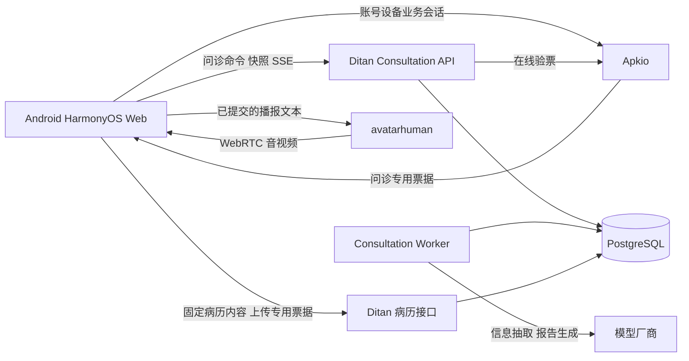
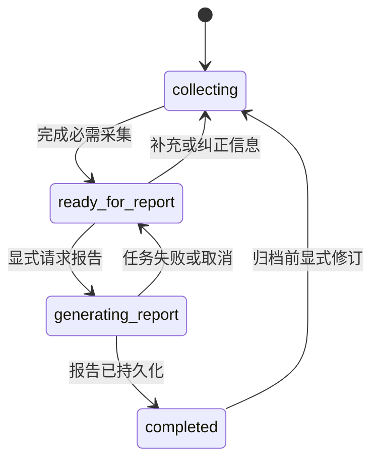

# 四诊问诊后端迁移设计

本文面向数字人、Android、HarmonyOS、Apkio 和 DitanBackend 的维护者，设计如何将 Coze 问诊工作流迁入自有后端，重点解决会话恢复、流程控制、消息重试和病历归档。依据为 2026 年 10 月 3 日本机代码及用户提供的[工作流设计文档](../../四诊“问诊”工作流后端设计.md)；这是待实施方案，尚未修改业务代码或验证线上故障。

建议在 **DitanBackend 内新增独立的 consultation 业务模块，用 PostgreSQL 保存问诊状态，用单独的 worker 执行模型任务**。数字人服务继续提供 WebRTC 和播报；Apkio 提供机构、操作员和设备身份；三个客户端共用问诊协议。第一版复用现有数据库和部署基础，无须额外引入 Redis、通用 Agent 框架或可视化工作流平台。

最先交付的能力应是：用户答到一半关闭客户端，重新进入后能看到原问题和已保存答案；服务重启后能恢复正在处理的任务；重复发送不会重复推进问题；数字人断开不会丢失问诊。

## 当前实现与迁移边界

| 位置 | 代码中的实际行为 | 对迁移的影响 |
| --- | --- | --- |
| [avatarhuman 的 SessionManager](../backend/application/session_manager.py) | 内存字典保存 runtime、WebRTC 连接、player；连接关闭会释放资源 | 这是媒体会话，不能作为持久问诊会话 |
| [Coze 代理](../backend/infrastructure/coze_proxy.py)与 [HTTP handler](../backend/api/handlers.py) | 创建 Coze conversation，转发 `/v3/chat` 的 SSE；请求启用 `auto_save_history` | 代理没有自己的问诊进度、消息落库或任务恢复能力 |
| [Web provider](../web/src/lib/providers/coze-provider.ts) | conversation ID 保存在闭包中；provider 重建或 reset 后丢失 | 刷新页面后的恢复需要新增持久引用与服务端快照 |
| [Android CozeGateway](../../MCT_Android/app/src/main/java/com/example/mct/platform/network/CozeGateway.kt) | 从构建配置读取 Coze 地址、凭证和 bot；直接调用 Coze 协议 | 仅修改 avatarhuman 的 `/coze` 路由不能覆盖 Android |
| [Android ConversationSession](../../MCT_Android/app/src/main/java/com/example/mct/feature/digitalhuman/domain/DigitalHumanConversationSession.kt) | conversation ID 只在对象内存中；`reset()` 清空 | 患者草稿与可恢复问诊引用尚未关联 |
| [Android SSE parser](../../MCT_Android/app/src/main/java/com/example/mct/platform/network/CozeStreamParser.kt) | 每次调用重新创建事件解析状态；gateway 逐块独立解码 UTF-8 | 网络分片跨事件、JSON 或汉字边界时存在丢内容风险；属于静态代码发现，尚未认定是线上故障主因 |
| [Harmony 服务](../../MCT_Harmonyos/entry/src/main/ets/platform/digitalhuman/HarmonyDigitalHumanService.ets)与 [页面](../../MCT_Harmonyos/entry/src/main/ets/pages/DigitalHumanPage.ets) | 页面保存 conversation ID；服务直连 Coze，含查询 chat 状态和消息列表的补偿逻辑 | 需要替换流式、查询和补偿协议；恢复聊天文本不等于恢复工作流 |
| 两个移动端的问诊流程 | 检测固定提示文案开放“获取报告”；把“获取报告”作为聊天输入发给 Coze | 改为服务端状态、明确的报告命令和报告完成事件 |
| [Ditan 聊天模型](../../DitanBackend/app/models/chat.py)与 [ChatService](../../DitanBackend/app/services/chat_service.py) | 已有按机构隔离的聊天历史；流式生成仍由请求驱动，助手全文在生成后保存 | 可以复用数据库及模型接入经验，但普通聊天表尚不具备问诊状态、幂等任务和断点事件 |
| [Apkio 上传协议](../../Apkio/docs/MEDICAL_UPLOAD_AUTH_CONTRACT.md) | 专用票据最长 300 秒，仅允许 `medical-record:write`，Ditan 在线验票 | 问诊读取、续问和生成报告需要新的 audience 和 scope |
| [Ditan 病历上传](../../DitanBackend/app/services/medical_record_service.py) | 同机构、同 UUID、相同规范化内容可重传；内容变化返回冲突 | 问诊草稿与最终上传快照必须分开管理 |

当前两个移动端还负责把基本信息、面诊、舌诊、脉诊结果拼成一大段首轮文本。新协议应直接提交结构化输入，由服务端统一组装模型上下文，避免三端提示词逐渐分叉。既有患者草稿和机构隔离机制可以扩展，无须全部重写。

## 服务分工



建议的仓库归属如下。API 和 worker 可以使用同一套 Ditan 代码及镜像，以不同启动命令运行；worker 的重启和模型调用并发不占用数字人 GPU 进程。

| 项目 | 本次承担的职责 |
| --- | --- |
| DitanBackend | 问诊 API、流程规则、槽位、会话、任务、事件、报告和病历关联；复用 FastAPI、SQLAlchemy、Alembic、PostgreSQL |
| Apkio | 签发与验证问诊专用凭证，复用现有账号、设备、机构和 License 校验 |
| avatarhuman | 媒体资源管理和播报；Web 新增 consultation provider；过渡期可保留旧 Coze 路由 |
| Android 与 HarmonyOS | 提交用户答案，恢复状态，展示进度与报告，管理录音及播放 |

建议在 Ditan 增加 `app/consultation/`，其中分别放 API/schema、工作流规则、服务、repository、模型适配器和 worker。通过现有路由汇总与 Alembic 接入。业务边界独立，先与病历后端共用代码库；以后负载确有需要时再拆成独立部署的 API 服务。

现有 `/api/v1/chat/*` 继续服务原来的医生聊天。新问诊有专门的认证、状态和表结构，避免将医生聊天的行为改成采集终端问诊。`TCMDiagnosisService` 中的后续病历整理、辨证和处方流程也应与本次预问诊报告区分；只复用经过核对的公共模型适配能力。

## 各类标识与生命周期

| 标识 | 含义 | 生命周期与恢复规则 |
| --- | --- | --- |
| `org_id`、`actor_user_id`、`device_id` | 机构、操作员、设备 | 从已验证身份取得；操作员不是患者 |
| `client_session_id` | Apkio 账号与设备的联合业务会话 | 可以到期、退出或被替换；变化不删除病历和问诊，但必须重新授权 |
| `encounter_uuid` | 本次就诊，对应现有病历 UUID | 开始采集即生成并持久化；一次新就诊一个 UUID |
| `consultation_id` | 本次就诊中的一次问诊实例 | 服务端生成的持久 ID；刷新、重新登录和服务重启均可保留 |
| `turn_id` 与 `run_id` | 一条答案及其处理任务 | 支持查询、失败重试和审计；报告任务也有独立 run |
| `client_request_id` | 客户端一次业务操作的幂等键 | 首次发送前持久化；不确定是否成功时必须沿用 |
| `event_seq` | 一个问诊内的事件顺序 | 服务端持久化；客户端用于去重和补收 |
| `media_session_id` | 当前 `/offer` 返回的 `sessionid` | 短生命周期，断连后可重建；不参与问诊身份判断 |

患者可能还没有上传到 Ditan，因此创建问诊时允许 `patient_id`、`record_id` 为空，用机构内的 `encounter_uuid` 加患者快照关联；上传后补充数据库外键。不能用手机号、设备 ID、Coze user ID 或媒体 session ID 作为问诊的唯一标识。

Android 的 [PatientSessionMapper](../../MCT_Android/app/src/main/java/com/example/mct/feature/patient/session/PatientSessionMapper.kt) 目前默认在映射落库实体时生成病例和预诊 UUID，需要把生成时间前移到采集开始，并在所有后续转换中复用。Harmony 的 [PatientSession](../../MCT_Harmonyos/libs/common-domain/src/main/ets/model/PatientSession.ets) 已在新草稿创建时分配这些标识，可以沿用。恢复旧问诊与基于旧患者创建新就诊必须是不同操作。

## 工作流与槽位

用户原文档中的“状态机加填槽”适合这条业务流程。服务端规则决定问什么、什么时候结束和何时允许报告；模型负责理解答案和生成报告。

一次普通问答建议为：

1. 读取本轮对应的问题、已确认槽位、有关原话和三诊输入快照。
2. 调用信息抽取模型，返回受 schema 约束的候选更新。
3. 服务端检查字段白名单、类型、枚举、证据引用和适用条件，再生成待提交的槽位变更。
4. 规则选择澄清项或下一道问题；允许一条回答补齐多个字段，跳过已有可靠答案。
5. 第一版用审核过的模板生成简短问题；需要更自然的表达时再增加可选的措辞模型。
6. 在同一事务提交槽位、问题、助手消息和会话进度，然后发布事件。

这样普通问题通常只需要一次抽取调用，模板也可以在措辞模型故障时直接使用。抽取失败时保留原答案并重试本轮，不把未理解的答案算作已完成。

### 工作流定义

用版本化的配置定义问题顺序、目标槽位、必填条件、适用条件、追问上限和模板。条件采用受限规则类型，由 Python 解释；不要执行配置中的任意 Python 表达式，也不要接受模型返回的执行代码。

| 原流程模块 | 新后端对应能力 |
| --- | --- |
| 获取年龄与性别 | 从生日和已确认资料预填；年龄由代码按问诊日期计算，保存计算基准日期 |
| 核心意图与病史 | 抽取主诉、既往史、用药史；同一句话可补多个槽 |
| 家族、工作、睡眠、夜尿、情绪、饮食、消化、运动 | 配置化问题组；跳过已回答项，必要时限次追问 |
| 女性生理阶段 | 依据明确回答和已确认资料计算适用问题；阶段未知时先确认 |
| 获取报告 | 显式业务命令，仅在服务端允许时受理 |
| 查询历史并生成结论 | 基于本地槽位、原话证据、三诊快照生成报告 |

原文档的 Mermaid 与示例 schema 还需逐项对齐：工作压力没有独立槽，运动习惯与耐受力在图中分开、schema 中合并，幼年模块缺少详情结构，胎动和骨密度等图中字段未逐一落实。实现前应形成一张“节点、输入、输出、适用条件、完成条件”的映射表。

原来的五种生理阶段也不是天然互斥的完备分类，例如既往怀孕、当前怀孕、是否生育、是否有月经是不同维度。建议保存这些基础事实，再计算当前问题组。业务负责人需确认分类及问题内容；程序不根据年龄或一句模糊回答猜测怀孕、绝经等事实。

### 槽位数据

示意结构如下，字段名和枚举属于本方案建议：

```json
{
  "slot_key": "sleep_quality",
  "value": {"sleep_hours": 5, "difficulty_falling_asleep": null},
  "status": "needs_clarification",
  "source_type": "patient_answer",
  "evidence": [{"message_id": "msg_example", "quote": "一般只睡五小时"}],
  "updated_by_turn_id": "turn_example",
  "revision": 4,
  "followup_count": 1,
  "clarification_reason": "尚未说明睡眠不足的原因"
}
```

建议支持 `empty`、`needs_clarification`、`conflict`、`answered`、`unknown`、`declined`、`not_applicable`。`answered` 表示采集信息足够，不代表医学事实已被医生证实；必要时另设 `confirmed_by_user` 和人工审核信息。

患者说“没有症状”是明确的否定答案；“不知道”是 `unknown`；未询问是 `empty`；不愿回答是 `declined`，不能混为一类。模型只能提出候选更新，`not_applicable`、全局阶段、报告权限和数据库 ID 都由后端确定。

冲突保留旧值、新候选值和双方证据，不静默覆盖。“平时很少吃夜宵”与“昨天吃了一次夜宵”未必矛盾，应记录频率和时间。患者明确纠正旧答案时保留修订记录；影响分支的纠正需要重算适用字段，原有证据仍保留。

完成条件是：**当前适用的必需信息满足该工作流版本的完成规则，关键冲突已解决，或按规则转交人工处理**。不要要求所有细分字段都必须确认。对非关键问题可接受“不知道”或拒答并记录缺项；追问次数设上限。缺少关键数据时应明确提示缺什么，而不是无限追问或假装已有完整结论。

### 模型上下文

服务端保存完整对话，但每轮按预算选取上下文：版本化提示词、当前问题、结构化槽位、相关证据、近期几轮消息和必要的三诊信息。摘要仅作为辅助，不能覆盖原文或成为唯一事实来源。姓名、电话等与当前模型任务无关的身份信息不放入模型提示词。

本方案采用每轮显式传入上下文的模型调用方式。数据库里的问诊记录负责记忆与进度，供应商只处理本次输入；即使更换模型，也从相同的本地输入快照重建请求。供应商提供的 conversation ID 或上下文缓存可以作为优化信息保存，但不承担问诊恢复的核心职责。

患者原话、三诊分析文本和历史摘要都是数据，不能充当系统指令。抽取结果必须校验 slot 白名单和证据归属，不能让模型直接提交 SQL、决定机构、跳过授权或宣布流程完成。

## 持久化结构

建议新增下列表结构。第一版槽位快照可以放 JSONB，消息和任务必须独立成行，避免每次更新整个聊天大 JSON。

| 表 | 关键数据 |
| --- | --- |
| `consultation_sessions` | ID、org、encounter UUID、患者快照引用、创建者、workflow/schema/prompt 版本、状态、当前 question ID、slots JSONB、version、input_revision、active_run_id、record_id |
| `consultation_inputs` | 不可变版本的患者资料、面舌脉分析、来源、时间、内容摘要；原始报告与规范化值分别保存 |
| `consultation_messages` | session、turn、role、内容、顺序、当前问题引用、accepted/committed/cancelled 等状态；用户原文保留 |
| `consultation_requests` | 所有写命令的幂等键、机构、资源范围、请求摘要、状态及结果引用；覆盖创建、答案、重试、资料修改、生命周期和导出 |
| `consultation_runs` | turn/report 类型、请求键与请求摘要、输入快照、状态、checkpoint、attempt、租约代次、租约截止、下次重试时间、错误码、模型版本与调用计量 |
| `consultation_events` | session、seq、run、事件类型、payload、生成尝试编号；可补收的持久事件日志 |
| `consultation_reports` | 输入 revision、版本化模型与提示词、结构化结果、正文 TEXT、内容摘要、完成状态 |
| `consultation_exports` | report/session 关联、固定的完整上传 DTO、摘要、获授权操作员、有效或失效状态和最终 record_id；每份导出不可变 |

所有数据通过带 `org_id` 的父子约束或受限父记录关联；查询和更新显式限定机构，不能只凭一个 UUID 访问。`session + seq`、`session + message_order` 设唯一约束；请求记录按 `org + resource_key + client_request_id` 唯一，命令类型纳入请求摘要。同一 session 的不同命令不能复用同一个请求键。创建问诊以 encounter UUID 作为资源范围，另有 `org + encounter_uuid + consultation_attempt` 唯一约束，并限制一次就诊仅一个开放问诊。

请求幂等记录与相应业务变化在同一事务提交；任务型命令记录 run 引用，立即完成的命令记录其结果。幂等记录保留期至少覆盖客户端允许的重试期限，不能清理后仍接纳该期限内的旧写请求作为新操作。

`version` 用于客户端并发校验；`input_revision` 只标识影响问诊或报告的已提交输入版本；租约心跳不修改它们。报告保存自己的输入 revision，资料或答案后来变化时旧报告仍可追溯，但不能作为当前最新报告使用。

原表 `sanzhen_analysis_results.diagnosis_result` 是 `String(1024)`，而 DTO 没有相同长度限制。迁移报告前应通过 Alembic 扩为 TEXT，或明确改为保存简短摘要及报告引用；不能把完整新报告未经处理写入该字段，更不能静默截断。

## 会话与任务状态

问诊业务状态建议为：



暂停、放弃、到期用单独的生命周期字段表示。关闭页面只结束订阅及媒体连接，不自动放弃问诊。归档后不允许用修订操作覆盖已提交病历；后续变更通过独立补充记录或新的就诊表达。

任务状态为 `queued → running → completed`，另有 `retry_wait`、`failed`、`cancelled` 和 `superseded`。上游模型失败改变任务状态，不清空整个问诊。报告任务失败后返回可再次申请报告的业务状态，已采集信息完整保留。

### 一轮输入的事务边界

1. 客户端先把待发内容、question ID、expected_version 和 `client_request_id` 写入本地待发队列，再发送。
2. API 完成授权与归属校验，先检查幂等键。同键同规范化请求返回原 run；同键不同请求返回 409。即使旧版本已过期，完全相同的重传也必须先命中原结果。
3. 短事务锁住 session，核对 expected_version、当前 question ID 和 active_run。写入用户消息与 queued run，记录不可变输入快照，设置 active_run，递增 version 并提交，然后返回 202。
4. worker 在短事务中领取任务，记录租约代次和截止时间，提交后才调用模型。抽取和计划结果以 checkpoint 持久化。
5. 普通追问生成完成后，在短事务中同时校验租约代次、有效期、run 状态、active_run 和预期会话版本。原子提交槽位变更、下一问题、助手消息、run 完成状态及对应事件。
6. API 订阅端从数据库读出已提交事件再发给客户端。worker 和 SSE 连接的生命周期独立。

模型调用期间不持有数据库行锁或长事务。第一版每个 session 只允许一个写入任务，第二个不同请求返回 `SESSION_BUSY` 和当前 run ID；客户端保留待发内容，刷新状态后由用户确认是否提交，不盲目排队回答一个已经改变的问题。

worker 可用 PostgreSQL `FOR UPDATE SKIP LOCKED` 领取任务，随后靠持久租约续期与失效回收。PostgreSQL 文档明确将队列表列为该机制的适用情况；它本身不提供任务恢复或恰好执行一次，后两者仍需上述状态与约束。[PostgreSQL SELECT 文档](https://www.postgresql.org/docs/current/sql-select.html#SQL-FOR-UPDATE-SHARE)

进程崩溃后由存活 worker 扫描过期租约并接手，增加租约代次；旧 worker 即使晚返回也不能写入事件或业务结果。超时重试带次数上限、退避和总 deadline。外部模型在网络不确定时可能被调用多次，但本地每个 run 的业务结果最多提交一次，不能宣称供应商调用或计费恰好一次。

失败任务的显式重试沿用原用户消息和 run，不新增一条相同答案。重试命令有自己的幂等键；只有业务输入 revision 仍匹配时才能复用 checkpoint，否则返回状态冲突并重新确认。取消也是显式命令，取消与完成竞争时以数据库先提交者为准；取消的用户原文保留但不作为已采纳事实进入后续上下文。

### 恢复行为

| 场景 | 应有行为 |
| --- | --- |
| POST 已提交但响应丢失 | 重发同一请求键，取得同一 run，不重复插入消息 |
| SSE 断开而任务仍执行 | worker 继续；恢复订阅补收事件或取最终结果 |
| API 进程重启 | 已入库 queued/running 任务仍可查；由 worker 继续处理 |
| worker 调模型时崩溃 | 租约超时后从 checkpoint 重试；不保证恢复供应商那一次生成 |
| 数据库提交后发送事件失败 | 从事件表重发；客户端按 seq 去重 |
| 两台设备同时回答 | 单任务限制、expected_version 和 question ID 阻止串题 |
| Apkio 登录到期 | 刷新授权后恢复同一问诊，不因 token 到期创建新问诊 |
| WebRTC 重连或 TTS 失败 | 重建媒体或显示文字，原问诊和模型结果保持可用 |

## API 与事件协议

以下是建议新增的接口，均不是现有已实现接口。所有写命令带 `Idempotency-Key`，其值对应本地持久化的 client_request_id；修改已有会话的命令还带 expected_version，报告命令另带 input_revision。读请求也必须校验授权及问诊归属。

| 方法与路径 | 含义 |
| --- | --- |
| `POST /api/v1/consultations` | 以 encounter UUID、预诊 UUID 和结构化输入创建问诊；同时保存首个问题；重复创建返回原实例 |
| `GET /api/v1/consultations?encounter_uuid=...` | 查找当前授权范围内该次就诊的问诊，不能只凭手机号恢复 |
| `GET /api/v1/consultations/{id}` | 恢复快照：状态、版本、当前问题、当前任务、报告引用和事件水位 |
| `GET /api/v1/consultations/{id}/messages?before=...` | 分页读取结构化消息 |
| `POST /api/v1/consultations/{id}/turns` | 提交答案，返回 202 和持久 run ID |
| `GET /api/v1/consultations/{id}/runs/{run_id}` | 查询任务、错误码及已完成结果 |
| `POST /api/v1/consultations/{id}/runs/{run_id}/retry` | 在输入仍匹配时重试失败任务 |
| `POST /api/v1/consultations/{id}/runs/{run_id}/cancel` | 显式取消任务；与关闭 SSE 无关 |
| `GET /api/v1/consultations/{id}/events?after=42` | 补收并订阅 seq 大于 42 的事件，也支持 `Last-Event-ID` |
| `POST /api/v1/consultations/{id}/inputs` | 在无运行中任务时提交新资料版本；重新校验槽位和报告时效 |
| `POST /api/v1/consultations/{id}/reports` | 按指定 input_revision 创建报告任务，相同请求可重入 |
| `GET /api/v1/consultations/{id}/reports/{report_id}` | 读取已保存的报告状态及正文 |
| `POST /api/v1/consultations/{id}/exports` | 固定最终上传内容，返回 export ID、规范化 DTO 和摘要 |
| `POST /api/v1/consultations/{id}/pause`、`/resume`、`/abandon` | 显式管理生命周期；有运行中任务时 pause/abandon 必须按取消规则处理 |

创建请求提交 `patient_snapshot` 和带来源的 `assessments`，不提交一大段包含提示词的“初始聊天”。优先引用服务端已有报告 ID；尚未上传的面舌脉结果可以通过此接口提交快照，但要标记为客户端来源。客户端不能选择机构、供应商密钥或任意 system prompt。恢复已有问诊也不能隐式覆盖其输入快照。

提交答案的请求示例：

```json
{
  "expected_version": 12,
  "reply_to_question_id": "question_sleep_2",
  "text": "通常只睡五个小时",
  "input_type": "asr"
}
```

响应示例：

```json
{
  "consultation_id": "consultation_example",
  "turn_id": "turn_example",
  "run_id": "run_example",
  "status": "queued",
  "version": 13
}
```

这些短 ID 仅用于示意，实际采用服务端生成的不可猜测标识。传输错误使用明确的 HTTP 状态和业务码，例如 `VERSION_CONFLICT`、`SESSION_BUSY`、`IDEMPOTENCY_CONFLICT`、`REPORT_NOT_READY`、`AUTH_EXPIRED`。HTTP 200 或 SSE EOF 都不能被客户端当作业务成功。

### 事件恢复

SSE 只承担结果分发。模型输出、任务状态和最终报告都应能通过普通 GET 恢复。标准 SSE 定义了 UTF-8 编码、事件缓冲和 `Last-Event-ID`；服务端仍需自行保存事件并实现按 ID 补收。[WHATWG SSE 标准](https://html.spec.whatwg.org/multipage/server-sent-events.html)

```text
id: 43
event: message.completed
data: {"run_id":"run_example","message_id":"message_example","text":"通常是什么原因让您只能睡五小时？"}

id: 44
event: session.updated
data: {"version":14,"state":"collecting","current_question_id":"question_sleep_3","can_generate_report":false}

id: 45
event: run.completed
data: {"run_id":"run_example"}

```

还需定义 `run.failed`、`run.cancelled`、`report.started`、`report.ready`。如果提供报告草稿流，再定义带 `message_id`、`attempt` 和 `offset` 的 `message.delta`、`message.reset`，最终以 `message.completed` 的全文校正。

事件 seq 在同一 session 的短事务内分配，业务状态和事件原子提交；不能用进程内计数器。快照与 `through_event_seq` 在同一个一致性读视图内取得，客户端先应用快照，再从该水位补收，避免快照与流之间漏事件。

客户端把本地已应用状态和 cursor 原子保存；重复事件忽略。补收与实时事件按同一序列发送，事件到达顺序不能依赖多个模型协程的回调先后。通知机制可以加速唤醒，但数据库事件表是事实来源；低并发第一版可用有界轮询读取。

事件保留期与病历保留期分开配置。cursor 已早于可补收范围时，在开启 SSE 前返回 `410 CURSOR_EXPIRED`，客户端重新获取快照和消息，再从新水位订阅。心跳不修改业务 cursor。网关禁用此路由的响应缓冲，连接超时要允许心跳通过。

三个客户端均使用可携带 Authorization 请求头的流式 HTTP 客户端；Web 可沿用 fetch 的流读取方式并增加自动恢复。UTF-8 解码器、半行缓冲、事件名及多行 data 都跨网络分片保留。订阅失败后先恢复授权，再重连或查询 run，不能重新调用模型生成接口。

### 与播报的关系

第一版的短问题先生成并提交完整消息，再按句分段播报。报告可展示生成进度和草稿，但仅将已完成且已保存的内容视为正式结果。这样无需在模型中断后猜测患者已经听到了哪一版未完成问题。

如果后续启用真正的逐 token 输出，模型中断后切换 provider 必须开始新的 attempt，并明确替换旧草稿，不能把两次生成拼接成一句话。业务槽位也不能在未完成的草稿上推进。

客户端解析事件、保存状态和派发语音应分开排队，不能因 `/human` 的网络延迟阻塞 SSE 读取。只让当前媒体连接消费新的播报段；派发任务固定捕获 `media_session_id` 和 `playback_epoch`，重连或打断时丢弃旧 epoch 的待播任务。

播放去重可用 `message_id + segment_index + playback_epoch`。恢复历史默认只恢复文字，由用户主动重播。现有 `/human` 没有跨进程播放幂等协议，因此不能保证音频恰好播放一次；在派发结果不确定时也不应无限自动重发。问诊结果已生成而 TTS 失败时，不重新跑问诊模型。

## 接入 Apkio 身份

现有 `medicalUploadToken` 仅授予病历上传；`clientSessionToken` 也按现行协议只发送给 Apkio。建议增加独立的问诊票据，复用签发和在线验证机制，不扩大现有上传票据的权限。

建议的新增契约为：

- Apkio `POST /api/client/consultation/token`：使用联合业务会话取票。
- Apkio `GET /api/client/consultation/current`：Ditan 在线校验问诊票据。
- audience 为 `ditan-consultation`，scope 按操作区分 `consultation:read`、`consultation:write`、`consultation:report`。
- 票据包含已验证的 org、user、device、client session 和有效期；短有效期参照现有取票方案，不持久化原始票据。

问诊接口不接受 body 中的 orgId 作为授权依据；会话列表、消息、报告、SSE 补收、取消和重试全部进行对象归属检查。新会话需绑定本次就诊，恢复时需核对机构、就诊及操作员权限，不能自动选取“这个设备的最后一个 session”。

第一版建议允许原操作员重新登录后恢复自己的未归档问诊；同机构的其他操作员接手使用明确的交接权限和审计。跨设备恢复不依赖最初 device ID 作为永久所有者，但必须通过新的有效授权。数据库的并发控制保证交接时旧设备不能用旧版本继续写入。

每个 API 请求及每次 SSE 建连均在线验票；401/403 停止访问，验票服务故障返回可重试 503，不回退匿名。长 SSE 建议每 30 秒复核来源会话，并在凭证到期时关闭，客户端重新取票后从 cursor 恢复。因此该新增流协议的撤销生效窗口建议上限为 30 秒，属于需要联调验收的设计值，不能套用成现有上传协议的承诺。

已经授权受理且处于总 deadline 内的模型任务，可以在客户端断连或凭证过期后完成，并保存在原机构名下；完成不授予旧连接读取权限，也不能触发未授权的后续任务。worker 使用入库的不可变身份上下文，不保存并复用用户短期票据。连接退出、切机构和设备交接时，沿用 Android 的 generation guard 与 Harmony 的 BusinessAccess epoch，拒绝旧回调进入新患者页面。

Apkio 故障仍会影响新操作的授权；将 Coze 替换掉不能消除所有外部依赖。会话持久化的价值是这些故障恢复后能够继续，而不是在授权失败时继续放行。

生产 Web 入口也需要接入机构身份或受控的终端会话。当前 Web 的无身份 `/coze` 调用方式不能直接套在可读取患者历史的新接口上。

## 模型接入与报告

建议定义两个核心接口：`extract_answer(input_snapshot) -> SlotPatchProposal` 和 `generate_report(input_snapshot) -> ReportDraft`。普通问题用模板；可选的 `phrase_question(plan)` 只负责措辞，无权选择流程节点。

先接一家可用供应商，配置中区分抽取模型与报告模型，记录供应商、确切模型标识、参数和 prompt 版本。首轮迁移不必同时建设多厂商调度；增加备用模型前，先用同一批样本验证字段抽取及报告格式。原文档写的 DeepSeek-V3 是原方案线索，实际可用模型标识和能力应在实施时根据账号及供应商接口确认。

即使供应商支持 JSON 输出，服务端也必须做字段与业务校验。DeepSeek 官方文档提醒 JSON 输出可能为空或因长度限制而截断；不能把“HTTP 成功”或“能解析 JSON”当成有效槽位更新。[DeepSeek JSON Output 文档](https://api-docs.deepseek.com/guides/json_mode/)

超时、连接错误、限流和临时服务错误做有上限的重试；schema 错误允许有限修复后失败；凭证错误和不支持的模型配置直接告警。SDK、worker 与网关不能各自无限叠加重试，必须共享总 deadline 和最大尝试数。未向用户发布内容时可重试或切备用模型；已发布草稿后按 attempt 替换语义处理。

报告任务固定以下输入：槽位与原话证据、面舌脉分析快照及其来源、缺失与拒答项、工作流版本、提示词版本、input_revision。报告输出分结构化结果与展示正文，存为独立版本；用幂等键及输入版本保证用户反复点按钮不会重复生成。

报告生成期间第一版拒绝修改输入；如需纠正，先明确取消报告任务，提交修订，再生成新报告。旧报告保留其版本和来源，不覆盖历史。模型生成报告与医生确认结果采用不同状态；不让预问诊完成事件自动冒充后续医生诊断完成。

## 病历归档与现有 DTO

Ditan 的现行规则是同 UUID、同内容重传，内容变化返回 409。因此不应在开始问诊时上传一个空报告病历，再用同 UUID 上传完整报告。

建议归档流程为：

1. 采集开始时固定 encounter UUID 和预诊 UUID。全部过程信息先写入 consultation 草稿、输入、消息和报告表。
2. 报告完成后，客户端确认完成此次采集，调用 `POST /consultations/{id}/exports`。服务端根据当前输入与最终报告固定一份完整的 `MedicalRecordCreate` DTO、export ID 和规范化摘要，客户端将它作为待上传记录持久化。
3. 客户端按原机制获取 medicalUploadToken，向原 `/api/v1/medical-record` 上传相同 DTO。建议增加可选请求头 `X-Consultation-Export-Id`，便于服务端核验并关联；旧客户端不带该头时保持原契约。
4. Ditan 对带 export ID 的请求额外检查同机构、导出时获授权的操作员、就诊和预诊 UUID、当前有效报告版本以及完整内容摘要。交接后的上传需重新授权导出。把病例写入与 consultation 的 record_id 绑定放在同一事务；现有 service 内部 commit 边界需要相应调整。
5. 超时后原 UUID、原 export、原内容重传，返回原 record ID；首次上传者审计不被重传覆盖。归档成功后关闭该问诊的修改入口。

对已经绑定新版问诊的 encounter UUID，上传必须提供有效 export 引用；不能通过省略请求头绕过报告版本检查。未绑定新版问诊的旧流程仍走原上传协议。归档检查、报告失效和问诊修订使用同一 session 的短事务锁，解决修改答案与后台上传并发的竞争。

导出后尚未上传时若要求改答案，必须显式使旧导出失效，取消本地旧待上传项，重新生成报告及导出；旧导出再到达服务端时返回冲突，防止后台任务上传过时内容。归档后的变化不通过该上传接口覆盖，另设计版本化补充记录。

过渡期保留 `coze_conversation_log` 字段名作为兼容投影，由服务端已提交消息生成 `User:`、`AI:` 文本；它不再意味着数据来源一定是 Coze。最终报告继续映射到现有 `diagnosis_result`，先处理前述长度限制。问诊真正的恢复依据是结构化消息、槽位、任务和版本，不能再把这段纯文本反向解析成可执行工作流。

新元数据通过 export 关联处理，不随意加入旧 DTO 的摘要计算，避免改变已上传记录的重传判定。对老记录的兼容分支和新关联分支均要保留组织隔离检查。

## 客户端改造位置

| 客户端 | 主要修改 | 可复用部分 |
| --- | --- | --- |
| Android | 替换 CozeGateway；RealtimeGateway 中拆出 ConsultationGateway；ConversationSession 存持久问诊引用；CozeStreamInteractor 转为类型化事件处理；ViewModel 根据服务端状态请求报告 | 录音、ASR、WebRTC、SpeechDispatchInteractor、现有业务身份 guard、患者草稿与上传队列 |
| HarmonyOS | 从 HarmonyDigitalHumanService 分离 ConsultationService；移除新路径中的 Coze chat 轮询补偿；DigitalHumanPage 从服务端快照恢复；扩展 PatientSession 和草稿 repository | HttpClient 流式读取、现有 SSE 缓冲思路、BusinessAccess epoch、录音和播放逻辑 |
| Web | 新增 consultation-provider；扩展 Provider 事件类型；hook 恢复持久引用与 cursor；生产入口接入身份 | AvatarApi、WebRTCClient、conversationController 的播报能力 |

三个客户端统一持久化：机构和操作员归属、encounter UUID、预诊 UUID、consultation ID、最后应用的版本和 event_seq、未确认的请求及其幂等键。按机构和患者草稿隔离存储，身份切换清空活动视图和播放队列；不可把旧机构的待发请求投递到新机构。

应用冷启动后的顺序是：恢复当前授权 → 找到该患者草稿的 consultation 引用 → 查询服务端快照及当前 run → 对齐本地消息和 cursor → 补收事件 → 按需重新建立媒体连接。不能在恢复入口默认调用 createConversation，也不应重新发送那段初始三诊提示文本。

界面至少区分“已保存，正在处理”“处理失败，可重试原答案”“需要补充信息”“可以生成报告”“报告已保存”。报告按钮读取 `can_generate_report`，完成页读取明确的 report ID。音频 phase 仍由客户端控制，问诊阶段以服务端为准。

因此客户端改动集中在网络协议、持久引用与状态协调层；相机、BLE、ASR、WebRTC 渲染和大部分页面布局可以沿用。

## 迁移顺序

| 阶段 | 交付内容 | 完成判据 |
| --- | --- | --- |
| 契约与样本 | 补齐工作流节点映射，确定槽位 schema、身份契约、API 和事件样例；整理脱敏或合成的原流程对照样本 | 每个旧节点都能对应新规则，三端可使用同一批协议 fixtures |
| 最小完整链路 | Ditan 会话、答案、幂等任务、事件和模板提问；Apkio 新票据；Android 先接一组问题；先用确定性假模型验证恢复，再接真实抽取模型 | 关闭 App、断 SSE、杀 worker、重复请求后均可继续同一问诊 |
| 全流程与归档 | 完整槽位和生理分支、报告任务、导出与现有上传关联；HarmonyOS 和 Web 接入 | 同一病例贯穿采集、问诊、报告、上传，并通过跨机构和多端冲突检查 |
| 灰度与切换 | 按机构或客户端版本对新建问诊启用自研引擎，保留旧引擎完成旧问诊的时间窗口 | 对照样本、恢复测试与实际小范围使用达标后，关闭新建 Coze 问诊 |

引擎和工作流版本在创建 session 时固定。发布后新 session 使用新版本，旧 session 继续旧版本，直到完成或执行有验证的迁移。回滚只影响后续新建路由；已经开始的自研问诊仍需要兼容的服务继续承接，不能把它的 ID 直接交给 Coze。

如确需暂时维持 Coze 风格的接口，可以在自有服务外加兼容适配层，但它只能减少部分客户端 UI 改动。旧客户端缺少持久幂等键、事件 cursor、明确阶段及新授权，单纯返回相似 SSE 不能实现完整恢复。由于移动端当前直接使用配置中的 Coze 地址，也无法只更新数字人后端就完成切换。

历史 Coze conversation 没有已确认的节点 checkpoint、槽位及规则版本。可先让现有会话在旧引擎结束；若必须迁入新引擎，应导入可取得的消息、重新抽取并让用户确认关键事实，标记迁移来源，不能声称无损恢复 Coze 内部状态。

## 验证与运维

首轮应优先验证数据不丢、不重复、不串人，然后评估模型质量和延迟。当前设计没有运行这些未来实现的测试。

| 检查 | 验收结果 |
| --- | --- |
| 同一幂等键重复请求、响应丢失后重传 | 同一个 turn/run，只推进一次流程；不同内容同键返回 409 |
| 同一答案被不同请求键并发发送 | 单任务与 expected_version 拦截竞争，不重复采纳 |
| worker 在模型前、抽取后、最终提交前后退出 | 输入不丢，checkpoint 可恢复，最终结果不重复 |
| 租约过期后旧 worker 返回 | 旧代次不能提交槽位、报告或事件 |
| SSE 在任意字节位置切断 | 中文、JSON、多行 data 均不损坏；重连不漏不重 |
| 只收到 delta，未收到完成事件 | 界面保持未完成状态，并查询 run 校正 |
| cursor 过期、快照与事件并发变化 | 重新取一致快照后继续，无状态倒退 |
| 一次回答包含多个信息、纠正旧答案、拒答与未知 | 正确填槽、保留来源、不无限追问 |
| 工作流发布中恢复旧问诊 | 继续使用原版本，问题与数据解释一致 |
| 模型超时、429、空 JSON、非法字段、部分输出 | 有限重试，不采纳非法结果，不把部分报告视为完成 |
| 报告重复点击、生成期间改资料、归档前修订 | 幂等生成；输入版本固定；旧报告和导出失效规则正确 |
| App 被结束、手机重启、重新登录、WebRTC 重建 | 恢复问诊 ID 和消息；媒体 ID 可变化；不自动重播历史 |
| 切机构、设备交接、注销、授权撤销 | 旧请求和回调无法污染新会话，历史访问受限 |
| 不同机构使用相同手机号或 encounter UUID | 数据相互隔离，所有子资源访问也隔离 |
| 固定病历重传、变更内容重传、旧 export 延迟到达 | 前者回原记录，后两者拒绝；没有半条病例和孤立关联 |

监控按 `request_id / consultation_id / run_id` 关联：排队等待、模型首响应与总耗时、JSON 校验失败率、租约接管次数、SSE 恢复成功率、问诊完成率、每次报告调用量与费用。默认日志不记录凭证、手机号、问诊全文及模型原始上下文。

运行任务设置总时限和供应商并发上限，启动时及运行期间持续回收过期租约；不能只在服务启动时扫描一次。会话无活动不等于任务失败，后台记录的保留策略与运行任务的 deadline 分开。完成的病历和报告不会因 Redis TTL 或进程内 session 清理而消失。

事件短期保存多久、问诊草稿可恢复多久、归档数据保留多久、原始音频是否保存，需要作为可配置的产品规则确定。数据库备份与恢复演练覆盖消息、输入版本、报告和迁移；只有保存 session ID 不足以保证恢复。

## 实施前需补齐的信息

现有本地工作流文档给出了主干流程及架构草案，但没有 Coze 每个节点的实际 prompt、输入输出 schema、代码节点、变量、知识库、插件、异常分支和已发布版本配置。迁移设计可以据此确定；达到旧流程行为等价还需要取得这些实际配置或导出文件，并建立对照样本。

另外需确定首批模型供应商及账号、关键字段的临床完成规则、人工接手方式、预期并发与响应目标。当前建议默认支持同一操作员的断网、冷启动、重新登录及服务重启恢复；同机构跨操作员接手在授权和界面上显式表达。恢复与保留时间不在本方案中擅自设为固定业务期限。

本轮建议的第一项实施任务是：**在 Ditan 中实现有授权的问诊创建、提交答案、查询原任务和恢复快照，并让 Android 接通一组真实问题。先证明持久会话和故障恢复有效，再扩展完整问诊内容。**

本文已检查本地来源链接、JSON 示例和代码块配对；Mermaid 图尚未使用渲染器预览。所有恢复与并发结果均为未来实现的验收要求，不是本轮已经通过的运行测试。
